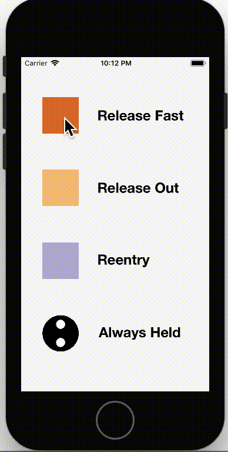

# SKSpriteButton

[](https://travis-ci.org/hanjoes/SKSpriteButton)
[](http://cocoapods.org/pods/SKSpriteButton)
[](http://cocoapods.org/pods/SKSpriteButton)
[](http://cocoapods.org/pods/SKSpriteButton)

## Info

SKSpriteButton is something obvious but somehow missing from the official SpriteKit library. 

## Usage 

This library should be very straightforward to use.

### Color

Set `tappedColor` property for a different display color when tapped. 

Since this widget inherits from SKSpriteNode, which will only show texture if both `texture` and `color` are set. `tappedColor` will not be shown if the button has a texture.

### Texture

Set `tappedTexture` property for displaying a different texture when tapped.

### Move Types

Set `moveType` property for different move types supported move types are:

```Swift
public enum MoveType {
    case alwaysHeld
    case releaseOut
    case releaseFast
    case reentry
}
```

The names should be self-explainatory. But still I put a screencast for different move type behaviors.



### More

There is no more, check `SKSpriteButton.swift` for public APIs.

## Example

I've built a simple example project to elaborate on how to use this widget. The example project shows how "move types" differ from each other.

To run the example project, clone the repo, and run `pod install` from the Example directory first.

__Note:__ I've actually included all files needed to compile the project in the git repo. You should be able to run the example even without `pod install`.

### Creating a group of toggled (radio) buttons
Use this when you want to create a group of radio buttons so that when one is selected (toggled on), the others will be deselected (toggled off). Note that when a group is created, then toggledOffHandlers will not be called.

```
    firstButton = SKSpriteButton(imageNamed:"InActive")
    firstButton.tappedTexture = SKTexture(imageNamed: "Active")
    firstButton.isToggleMode = true
    firstButton.isToggledOn = true      // Preload state
    
    // The assigned handler should not only handle firstButton toggled on
    // but all other buttons in the group being toggled off
    firstButton.addToggleOnHandler(handler: self.showTab1)  
    
    secondButton =  SKSpriteButton(imageNamed:"InActive")
    secondButton.tappedTexture = SKTexture(imageNamed: "Active")
    secondButton.isToggleMode = true
    secondButton.isToggledOn = false      // Preload state
    
    // The assigned handler should not only handle secondButton toggled on
    // but all other buttons in the group being toggled off
    secondButton.addToggleOnHandler(handler: self.showTab2)

    // Create a button group for each button
    firstButton.addToggleGroup(button:secondButton)
    secondButton.addToggleGroup(button:firstButton)
```

## Requirements

## Installation

SKSpriteButton is available through [CocoaPods](http://cocoapods.org). To install
it, simply add the following line to your Podfile:

```ruby
pod 'SKSpriteButton'
```

## Author

hanjoes, hanzhou87@gmail.com

## License

SKSpriteButton is available under the MIT license. See the LICENSE file for more info.

## Contributors

hanjoes

nader-eloshaiker
